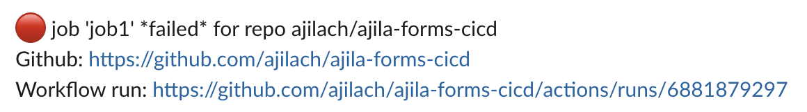

# notifications-ghaction
GitHub Action to deliver notifications

Currently, this [composite action](https://docs.github.com/en/actions/creating-actions/creating-a-composite-action) posts messages to [Slack](https://slack.com) either for completing a workflow or for pointing out failing jobs.

**Note:** This action requires [1Password](https://1password.com/) for secret management.

## Usage example

The following snippet calls the action to report the failed job status which occured during execution of failing `job1`.


```yaml
jobs:
  job1:
    runs-on: ubuntu-latest
    steps:
      - name: Failing Step
        run: exit 1
      - name: Notify workflow status
        uses: ./.github/actions/notification
        with:
          op_service_account_token: ${{ secrets.OP_SERVICE_ACCOUNT_TOKEN }}
          slack_channel_id: "C064B4VDB5G"
          workflow_status: "${{ job.status }}"
          workflow_completion_notification: "true"
        if: always()
```

Here is a screenshot how a message on slack looks like:




## Parameters

`op_service_account_token`: the 1Password service account token. Ideally this one is saved as GitHub secret.

`slack_channel_id`: the Slack channel ID used to post the messages to.

`workflow_status`: should always be set to `"${{ job.status }}"` so that the action has the job context.

`workflow_completion_notification`: can be set to either `"true"` or `"false"`. Note that we are passing in strings here since a composite action cannot accept boolean values.